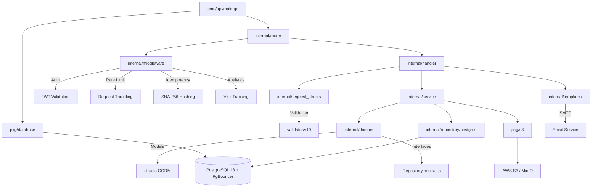

# 🏛️ ColPsiCarabobo API

> **[⬆ Raíz](../)** — `api/`

Backend REST API para la gestión del Colegio de Psicólogos de Carabobo (Venezuela) — directorio de psicólogos, publicaciones, analytics y administración. Construida con Clean Architecture en Go, desplegada con Docker Compose y documentada con Swagger/OpenAPI.

---

## 📋 Tabla de Contenidos

- [Arquitectura](#-arquitectura)
- [Estructura del Proyecto](#-estructura-del-proyecto)
- [Inicio Rápido](#-inicio-rápido)
- [Variables de Entorno](#-variables-de-entorno)
- [API Endpoints](#-api-endpoints)
- [Seguridad](#-seguridad)
- [Base de Datos](#-base-de-datos)
- [Stack Tecnológico](#-stack-tecnológico)
- [Testing](#-testing)
- [Desarrollo](#-desarrollo)
- [Documentación por Módulo](#-documentación-por-módulo)

---

## 🏗️ Arquitectura

El proyecto sigue **Clean Architecture** con separación clara en capas:

```
Domain (Modelos + Interfaces)
    ↓
Repository Interface (contratos de acceso a datos)
    ↓
Service (lógica de negocio pura)
    ↓
Handler (adaptadores HTTP)
    ↓
Router (definición de rutas)
```

### Convención del proyecto Go

Estructura basada en el layout estándar de Go:

- `cmd/` — Puntos de entrada (main.go)
- `internal/` — Código privado del proyecto (no exportable)
- `pkg/` — Paquetes compartidos reutilizables
- `docs/` — Documentación generada (Swagger)
- `migrations/` — Migraciones de base de datos (Atlas)

### Diagrama de Arquitectura



---

## 📁 Estructura del Proyecto

```
api/
├── cmd/
│   ├── api/main.go                    # Entry point — Fiber server bootstrap
│   └── exp/migrate/main.go            # Atlas migration schema generator
├── docs/
│   ├── docs.go                        # Swagger initialization
│   ├── swagger.json                   # OpenAPI 2.0 spec (JSON)
│   └── swagger.yaml                   # OpenAPI 2.0 spec (YAML)
├── migrations/
│   ├── 20260604165811_init.sql        # Initial DB schema (15 tables)
│   └── atlas.sum                      # Atlas checksum
├── pkg/
│   ├── database/
│   │   ├── postgres.go                # GORM + PgBouncer connection
│   │   ├── seed.go                    # Default admin seed
│   │   └── migration.go              # AutoMigrate + unique constraints
│   └── s3/
│       ├── s3.go                      # AWS S3 / MinIO client
│       └── upload.go                  # File upload with UUID naming
└── internal/
    ├── config/env.config.go           # Singleton environment config
    ├── domain/                         # Models + Repository interfaces
    ├── handler/                        # HTTP handlers (6 archivos, 30+ endpoints)
    ├── middleware/                      # Auth, Rate Limiter, Idempotency, Analytics
    ├── repository/postgres/            # GORM implementations (4 repos)
    ├── request_structs/                # DTOs with validation
    ├── router/                         # Route definitions (5 archivos)
    ├── service/                        # Business logic (10 módulos)
    ├── templates/                      # Embedded HTML email templates
    └── utils/                          # 10 funciones utilitarias
```

---

## 🚀 Inicio Rápido

### Requisitos previos

- Docker y Docker Compose v2+
- Go 1.25+ (solo para desarrollo local)
- Atlas CLI (para migraciones)
- swag CLI (para generar documentación Swagger)

### Con Docker Compose (recomendado)

```bash
# 1. Clonar el repositorio
git clone https://github.com/tu-org/ColPsiCarabobo.git
cd ColPsiCarabobo/api

# 2. Configurar variables de entorno
cp .env.example .env
# Editar .env con tus valores

# 3. Levantar todos los servicios
docker-compose up -d

# 4. Verificar que los servicios estén corriendo
docker-compose ps
```

### Servicios disponibles

| Servicio  | URL                           | Descripción               |
| :-------- | :---------------------------- | :------------------------ |
| **API**       | http://localhost:8080          | Endpoint principal REST   |
| **Swagger**   | http://localhost:8080/swagger/ | Documentación interactiva |
| **PgAdmin**   | http://localhost:5050          | Administración PostgreSQL |
| **MinIO**     | http://localhost:9001          | Console de almacenamiento |

### Credenciales por defecto (PgAdmin)

- **Email:** admin@admin.com
- **Contraseña:** admin

### Super Admin (seed inicial)

`pkg/database/seed.go` crea un admin inicial solo si no existe ninguno:

- **Usuario:** `admin` — **Email:** `admin@colpsicarabobo.com`
- **Contraseña:** `admin123` en `development`; en **producción** se genera aleatoria
  (16 caracteres) y se loguea la advertencia de cambiarla al primer login.

---

## 🔧 Variables de Entorno

Las variables se cargan desde el archivo `.env` en la raíz del proyecto
(ver [`api/.env.example`](./.env.example)). Lista completa en
`internal/config/env.config.go`:

| Variable              | Descripción                                    | Valor por defecto           |
| :-------------------- | :--------------------------------------------- | :-------------------------- |
| `PORT`                | Puerto del servidor HTTP                       | `8080`                      |
| `APP_ENV`             | Entorno: `development` / `production`          | `production`                |
| `DB_HOST`             | Host de PostgreSQL                             | `localhost`                 |
| `DB_PORT`             | Puerto de PostgreSQL                           | `5432`                      |
| `DB_USER`             | Usuario de PostgreSQL                          | `postgres`                  |
| `DB_PASSWORD`         | Contraseña de PostgreSQL                       | `postgres`                  |
| `DB_NAME`             | Nombre de la base de datos                     | `colpsi_db`                 |
| `S3_ENDPOINT`         | Endpoint **interno** del SDK (host Docker)     | `http://localhost:9000`     |
| `S3_PUBLIC_URL`       | URL **pública** accesible desde el navegador (Path-Style `{endpoint}/{bucket}`) | `http://localhost:9000` |
| `AWS_S3_BUCKET`       | Nombre del bucket S3                           | `colpsi-bucket`             |
| `AWS_REGION`          | Región de AWS S3                               | `us-east-1`                 |
| `AWS_ACCESS_KEY_ID`   | Access Key de S3/MinIO                         | `minioadmin`                |
| `AWS_SECRET_ACCESS_KEY` | Secret Key de S3/MinIO                       | `minioadmin`                |
| `SMTP_HOST`           | Host del servidor SMTP                         | `localhost`                 |
| `SMTP_PORT`           | Puerto SMTP (dev: MailHog `1025`)              | `1025`                      |
| `SMTP_USER` / `SMTP_PASS` | Credenciales SMTP                         | *(vacío)*                   |
| `SMTP_FROM`           | Email remitente                                | `info@colpsicarabobo.com`   |
| `APP_URL`             | URL pública del frontend (inyectada en los correos) | `http://localhost:3000` |
| `MAIL_SIGNATURE`      | Firma institucional tras "Atentamente" en los correos | `Administración ColPsiCarabobo` |
| `ALLOWED_ORIGINS`     | Orígenes CORS permitidos (separados por coma)  | `http://127.0.0.1:3000, http://localhost:3000` |
| `VALKEY_ADDR`         | Valkey/Redis para rate limiting (vacío = en memoria) | *(vacío)*            |
| `JWT_LIBRARY_SECRET`  | Secreto de librería JWT externa                | *(vacío)*                  |
| `ABS_ADMIN_TOKEN`     | Token absoluto de admin (respaldo)             | *(vacío)*                  |

> **`S3_ENDPOINT` vs `S3_PUBLIC_URL`** — son propositivamente distintos:
> el SDK (subir/bajar objetos) usa el endpoint interno del contenedor
> (`s3:9000` en Docker), mientras que las URLs que ve el navegador se
> construyen con `S3_PUBLIC_URL` (`GetPublicURL()` en `pkg/s3/s3.go`).
> Mezclarlos rompe la carga de imágenes en el browser.

---

## 📡 API Endpoints

Todas las rutas prefijadas con `/api/v1`. Documentación interactiva disponible en `/swagger/`.

### Autenticación

| Método  | Endpoint                          | Descripción                | Auth   |
| :------ | :-------------------------------- | :------------------------- | :----- |
| `POST`  | `/api/v1/auth/login`              | Login de administrador     | No     |
| `POST`  | `/api/v1/psi/login`               | Login del psicólogo        | No     |
| `POST`  | `/api/v1/psi/me/logout`           | Logout psicólogo           | JWT    |

> ⚠️ Las rutas `admin/*` están protegidas por `ProtectedAdmin404()`: sin un JWT
> válido responden **404** ("Cannot PATCH /api/v1/admin/psi/:id"), no 401, para
> ocultar la topología del panel. Si una llamada desde el frontend devuelve
> "Cannot ...", el token no está llegando (revisar cookie HttpOnly `jwt` en las
> server actions), no que la ruta no exista.

### Administradores

| Método   | Endpoint                          | Descripción                | Auth   |
| :------- | :-------------------------------- | :------------------------- | :----- |
| `GET`    | `/api/v1/admin`                   | Listar administradores     | JWT    |
| `GET`    | `/api/v1/admin/:id`               | Obtener admin por ID       | JWT    |
| `POST`   | `/api/v1/admin`                   | Crear administrador        | JWT    |
| `PATCH`  | `/api/v1/admin/:id`               | Actualizar administrador   | JWT    |
| `DELETE` | `/api/v1/admin/:id`               | Eliminar administrador     | JWT    |
| `PATCH`  | `/api/v1/admin/:id/password`      | Actualizar contraseña      | JWT    |

### Psicólogos

| Método   | Endpoint                          | Descripción                        | Auth   |
| :------- | :-------------------------------- | :--------------------------------- | :----- |
| `GET`    | `/api/v1/psi/directory`           | Directorio (búsqueda/filtros)      | No     |
| `GET`    | `/api/v1/psi/:id`                 | Perfil público del psicólogo       | No     |
| `GET`    | `/api/v1/psi/public/sitemap-data` | Datos para sitemap público         | No     |
| `GET`    | `/api/v1/psi/me`                  | Perfil propio (autogestión)        | JWT    |
| `PATCH`  | `/api/v1/psi/me`                  | Actualizar perfil propio           | JWT    |
| `POST`   | `/api/v1/psi/me/postgrades`       | Agregar postgrado                  | JWT    |
| `POST`   | `/api/v1/psi/me/social`           | Agregar red social                 | JWT    |
| `GET`    | `/api/v1/admin/psi/list`          | Listar psicólogos (admin)          | JWT    |
| `POST`   | `/api/v1/admin/psi/create`        | Crear psicólogo (admin, idempotente) | JWT  |
| `POST`   | `/api/v1/admin/psi/upload-csv`    | Importar CSV (admin)               | JWT    |
| `GET`    | `/api/v1/admin/psi/:id`           | Detalle psicólogo (admin)          | JWT    |
| `PATCH`  | `/api/v1/admin/psi/:id`           | Actualizar psicólogo (admin)       | JWT    |
| `DELETE` | `/api/v1/admin/psi/:id`           | Eliminar psicólogo (admin)         | JWT    |
| `POST`   | `/api/v1/admin/psi/:id/reset-password` | Reiniciar clave (temporal de 12 chars; invalida sesiones y la envía por correo) | JWT |

### Publicaciones (Posts)

| Método   | Endpoint                          | Descripción                | Auth   |
| :------- | :-------------------------------- | :------------------------- | :----- |
| `GET`    | `/api/v1/posts`                   | Listar posts (por categoría)| No     |
| `GET`    | `/api/v1/posts/:id`               | Obtener post por slug      | No     |
| `POST`   | `/api/v1/posts`                   | Crear publicación          | JWT    |
| `PATCH`  | `/api/v1/posts/:id`               | Actualizar publicación     | JWT    |
| `DELETE` | `/api/v1/posts/:id`               | Eliminar publicación       | JWT    |

### Especialidades

| Método   | Endpoint                          | Descripción                    | Auth   |
| :------- | :-------------------------------- | :----------------------------- | :----- |
| `GET`    | `/api/v1/specialties`             | Listar especialidades activas  | No     |
| `GET`    | `/api/v1/specialties/:id`         | Obtener especialidad           | No     |
| `POST`   | `/api/v1/specialties`             | Crear especialidad (admin)     | JWT    |
| `PATCH`  | `/api/v1/specialties/:id`         | Actualizar especialidad (admin)| JWT    |
| `DELETE` | `/api/v1/specialties/:id`         | Desactivar especialidad (admin)| JWT    |

### Analytics

| Método  | Endpoint                          | Descripción                    | Auth   |
| :------ | :-------------------------------- | :----------------------------- | :----- |
| `GET`   | `/api/v1/analytics/dashboard`     | Estadísticas del dashboard     | JWT    |
| `GET`   | `/api/v1/analytics/reports`       | Reportes detallados            | JWT    |

---

## 🛡️ Seguridad

La API implementa múltiples capas de protección:

| Capa                      | Implementación                                                        |
| :------------------------ | :-------------------------------------------------------------------- |
| **Autenticación JWT**         | Tokens firmados con rotación de claves; expiración configurable       |
| **Control de Roles**          | `ADMINISTRADOR`, `SUPER_USUARIO`, `USUARIO` con permisos granulares  |
| **Rate Limiting**             | 10 req/15min en auth; 5 req/30min en endpoints admin                 |
| **Idempotency**               | Protección contra requests duplicados con SHA-256 del body           |
| **Ocultamiento de Admin**     | No-admins reciben 404 (no 403) al acceder a recursos admin           |
| **Privacy Shield**            | Perfiles públicos ocultan datos sensibles (cédula, email, teléfono)  |
| **Validación de Imágenes**    | Verificación de magic bytes, no solo extensión de archivo            |
| **Fuerza de Contraseña**      | Requisitos mínimos de complejidad en contraseñas                     |
| **CORS**                      | Configuración de orígenes permitidos para requests cross-origin      |

---

## 🗄️ Base de Datos

- **Motor:** PostgreSQL 18
- **Connection Pooling:** PgBouncer en modo transacción
- **ORM:** GORM con AutoMigrate para desarrollo
- **Migraciones:** Atlas CLI para control de versionado de esquema
- **Esquema:** 15+ tablas con relaciones definidas

### Restricciones únicas

| Tabla           | Campo                | Descripción                    |
| :-------------- | :------------------- | :----------------------------- |
| `administradores` | `cedula`             | Cédula de identidad única      |
| `psicologos`      | `email`              | Email único por psicólogo      |
| `psicologos`      | `telefono`           | Teléfono único                 |

### Migraciones Atlas

```bash
# Generar esquema desde Go
go run cmd/exp/migrate/main.go > schema.sql

# Crear migración diff
atlas migrate diff --env local

# Aplicar migraciones pendientes
atlas migrate apply --env local
```

---

## 📦 Stack Tecnológico

| Componente              | Tecnología                  |
| :---------------------- | :-------------------------- |
| **Lenguaje**                | Go 1.25+                    |
| **Framework HTTP**          | Fiber v2                    |
| **ORM**                     | GORM                        |
| **Base de Datos**           | PostgreSQL 18               |
| **Connection Pool**         | PgBouncer (transaction)     |
| **Almacenamiento**          | AWS S3 / MinIO              |
| **Migraciones**             | Atlas                       |
| **Autenticación**           | JWT (golang-jwt)            |
| **Validación**              | validator/v10               |
| **Documentación API**       | Swagger/OpenAPI 2.0         |
| **Contenedores**            | Docker + Docker Compose     |
| **Procesamiento de Imágenes**| libwebp (conversión WebP)  |
| **Email**                   | HTML templates embebidos    |
| **Configuración**           | Variables de entorno (dotenv)|

---

## 🧪 Testing

Suite integral: **49 archivos de test, 253 funciones Test, 30 benchmarks, 62.3% cobertura global.**

### Comandos Rápidos

```bash
# Tests unitarios (sin DB, rápidos)
make test-unit

# Tests de repositorio (PostgreSQL real)
make test-repo

# Tests de integración (full stack: DB + Fiber + JWT)
make test-integration

# Tests de seguridad (43 tests E2E)
make test-security

# Todos los tests (serial, -p 1)
make test-all

# Todos con race detector
make test-race

# Benchmarks
make test-bench

# Reporte de cobertura
make coverage

# Reporte HTML interactivo
make coverage-html
```

### Infraestructura

| Componente | Detalle |
|:-----------|:--------|
| DB de test | PostgreSQL 18 en puerto 5433 (`docker-compose.test.yml`) |
| Aislamiento | Transacciones revertidas + `truncateAll()` al final de TestMain |
| Mocks | Hand-rolled func override pattern (sin gomock/mockgen) |
| Serial | `-p 1` para evitar race conditions entre paquetes |

### Cobertura por Paquete

| Paquete | Cobertura |
|:--------|----------:|
| `config`, `logger`, `request_structs` | **100%** |
| `middleware` | 77.3% |
| `domain` | 71.4% |
| `repository/postgres` | 68.2% |
| `handler` | 64.2% |
| `utils` | 63.8% |
| `database` | 55.1% |

> Documentación completa en **[TESTING.md](./TESTING.md)**

---

## 🛠️ Desarrollo

### Comandos disponibles

```bash
# Generar documentación Swagger
swag init -g cmd/api/main.go -o docs/

# Generar esquema SQL desde modelos Go
go run cmd/exp/migrate/main.go > schema.sql

# Crear nueva migración con Atlas
atlas migrate diff --env local

# Aplicar migraciones pendientes
atlas migrate apply --env local

# Ejecutar todos los tests
go test ./...

# Ejecutar tests con cobertura
go test ./... -cover

# Compilar binario
go build -o api ./cmd/api

# Ejecutar en desarrollo (sin Docker)
go run cmd/api/main.go

# Vet y lint del código
go vet ./...
```

### Desarrollo local sin Docker

```bash
# 1. Asegurar que PostgreSQL esté corriendo localmente
# 2. Configurar variables de entorno en .env
# 3. Ejecutar migraciones
go run cmd/exp/migrate/main.go > schema.sql
atlas migrate apply --env local

# 4. Compilar y ejecutar
go run cmd/api/main.go
```

### Estructura de un nuevo módulo

Al agregar un nuevo dominio al proyecto, seguir este orden:

1. **Modelo:** Crear struct en `internal/domain/`
2. **Interfaz:** Definir repository interface en `internal/domain/`
3. **Repositorio:** Implementar en `internal/repository/postgres/`
4. **Servicio:** Crear lógica de negocio en `internal/service/`
5. **Request Structs:** Definir DTOs en `internal/request_structs/`
6. **Handler:** Crear handler HTTP en `internal/handler/`
7. **Router:** Registrar rutas en `internal/router/`
8. **Middleware:** Aplicar auth/validación según corresponda
9. **Swagger:** Documentar con anotaciones en el handler
10. **Tests:** Escribir tests unitarios y de integración

---

## 🔄 Cambios recientes (fixes de integración)

Resumen de los cambios recientes que tocan el comportamiento de la API y su
contrato con el frontend (`web/`). Detalle de commits en `git log`.

### 1. URLs públicas de S3/MinIO (imágenes rotas en el navegador)

- **Problema:** el API devolvía URLs con el host interno del contenedor
  (`http://s3:9000/...`), irresoluble desde el browser → `` roto.
- **Solución:** nueva variable `S3_PUBLIC_URL` (`internal/config/env.config.go`),
  separada de `S3_ENDPOINT`. `GetPublicURL()` (`pkg/s3/s3.go`) construye URLs con
  la pública en formato Path-Style `{publicUrl}/{bucket}/{key}` y devuelve `""`
  ante keys vacías. El compose fija `S3_ENDPOINT=http://s3:9000` (interno) y
  `S3_PUBLIC_URL=http://localhost:9000` (navegador).
- **Frontend:** `bucketUrl()` es idempotente — acepta keys y URLs absolutas.

### 2. JWT en cookie HttpOnly para server actions (404 enmascarado)

- **Problema:** el panel admin devolvía "Cannot PATCH ..." porque las server
  actions no llevaban token; el **404 lo emitía el middleware**
  `ProtectedAdmin404()` (`internal/middleware/auth.go`), no la ruta.
- **Solución:** el frontend persiste el JWT en la cookie HttpOnly `jwt`
  (`web/src/lib/actions/auth.ts` + `syncJwtCookie` en login), y `web/src/lib/api.ts`
  la lee en SSR para autenticar contra la API.

### 3. Sanitización XSS — barrera final en la API

- `bluemonday.UGCPolicy()` limpia `full_bio` antes de persistir
  (`psi_service_self_management.go:223`, `psi_user_admin_service.go:422`) y el
  contenido de posts (`post_service.go`). La sanitización del frontend es solo
  defensa en profundidad; la API es la barrera de confianza.

### 4. Worker de email asíncrono

- `mail_service.go` procesa la cola en segundo plano con throttling (batch de 30)
  y jittering (pausas de 60–180s) anti-spam. El host de dev es **MailHog**
  (`SMTP_HOST=localhost`, `SMTP_PORT=1025`, profile `dev` del compose); si no
  está levantado, los errores `no such host` en los logs son **ruido no
  bloqueante** del worker, no fallos de la petición HTTP.

---

## 🧭 Navegación

| Subdirectorio                       | Descripción                                    |
| :---------------------------------- | :--------------------------------------------- |
| [`cmd/`](./cmd/)                    | Puntos de entrada (servidor API, herramientas) |
| [`docs/`](./docs/)                  | Documentación Swagger/OpenAPI                  |
| [`internal/`](./internal/)          | Lógica de negocio (Clean Architecture)         |
| [`migrations/`](./migrations/)      | Migraciones de base de datos (Atlas)           |
| [`pkg/`](./pkg/)                    | Paquetes compartidos (DB, S3)                  |

**[⬆ Volver a raíz](../)**
