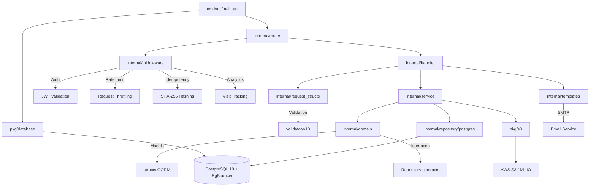

# 🏛️ ColPsiCarabobo API

Backend REST API para la gestión del Colegio de Psicólogos de Carabobo (Venezuela) — directorio de psicólogos, publicaciones, analytics y administración. Construida con Clean Architecture en Go, desplegada con Docker Compose y documentada con Swagger/OpenAPI.

---

## 📋 Tabla de Contenidos

- [Arquitectura](#-arquitectura)
- [Estructura del Proyecto](#-estructura-del-proyecto)
- [Inicio Rápido](#-inicio-rápido)
- [Variables de Entorno](#-variables-de-entorno)
- [API Endpoints](#-api-endpoints)
- [Seguridad](#-seguridad)
- [Base de Datos](#-base-de-datos)
- [Stack Tecnológico](#-stack-tecnológico)
- [Desarrollo](#-desarrollo)
- [Documentación por Módulo](#-documentación-por-módulo)

---

## 🏗️ Arquitectura

El proyecto sigue **Clean Architecture** con separación clara en capas:

```
Domain (Modelos + Interfaces)
    ↓
Repository Interface (contratos de acceso a datos)
    ↓
Service (lógica de negocio pura)
    ↓
Handler (adaptadores HTTP)
    ↓
Router (definición de rutas)
```

### Convención del proyecto Go

Estructura basada en el layout estándar de Go:

- `cmd/` — Puntos de entrada (main.go)
- `internal/` — Código privado del proyecto (no exportable)
- `pkg/` — Paquetes compartidos reutilizables
- `docs/` — Documentación generada (Swagger)
- `migrations/` — Migraciones de base de datos (Atlas)

### Diagrama de Arquitectura



---

## 📁 Estructura del Proyecto

```
api/
├── cmd/
│   ├── api/main.go                    # Entry point — Fiber server bootstrap
│   └── exp/migrate/main.go            # Atlas migration schema generator
├── docs/
│   ├── docs.go                        # Swagger initialization
│   ├── swagger.json                   # OpenAPI 2.0 spec (JSON)
│   └── swagger.yaml                   # OpenAPI 2.0 spec (YAML)
├── migrations/
│   ├── 20260604165811_init.sql        # Initial DB schema (15 tables)
│   └── atlas.sum                      # Atlas checksum
├── pkg/
│   ├── database/
│   │   ├── postgres.go                # GORM + PgBouncer connection
│   │   ├── seed.go                    # Default admin seed
│   │   └── migration.go              # AutoMigrate + unique constraints
│   └── s3/
│       ├── s3.go                      # AWS S3 / MinIO client
│       └── upload.go                  # File upload with UUID naming
└── internal/
    ├── config/env.config.go           # Singleton environment config
    ├── domain/                         # Models + Repository interfaces
    ├── handler/                        # HTTP handlers (6 archivos, 30+ endpoints)
    ├── middleware/                      # Auth, Rate Limiter, Idempotency, Analytics
    ├── repository/postgres/            # GORM implementations (4 repos)
    ├── request_structs/                # DTOs with validation
    ├── router/                         # Route definitions (5 archivos)
    ├── service/                        # Business logic (10 módulos)
    ├── templates/                      # Embedded HTML email templates
    └── utils/                          # 10 funciones utilitarias
```

---

## 🚀 Inicio Rápido

### Requisitos previos

- Docker y Docker Compose v2+
- Go 1.25+ (solo para desarrollo local)
- Atlas CLI (para migraciones)
- swag CLI (para generar documentación Swagger)

### Con Docker Compose (recomendado)

```bash
# 1. Clonar el repositorio
git clone https://github.com/tu-org/ColPsiCarabobo.git
cd ColPsiCarabobo/api

# 2. Configurar variables de entorno
cp .env.example .env
# Editar .env con tus valores

# 3. Levantar todos los servicios
docker-compose up -d

# 4. Verificar que los servicios estén corriendo
docker-compose ps
```

### Servicios disponibles

| Servicio  | URL                           | Descripción               |
| :-------- | :---------------------------- | :------------------------ |
| **API**       | http://localhost:8080          | Endpoint principal REST   |
| **Swagger**   | http://localhost:8080/swagger/ | Documentación interactiva |
| **PgAdmin**   | http://localhost:5050          | Administración PostgreSQL |
| **MinIO**     | http://localhost:9001          | Console de almacenamiento |

### Credenciales por defecto (PgAdmin)

- **Email:** admin@admin.com
- **Contraseña:** admin

---

## 🔧 Variables de Entorno

Las variables se cargan desde el archivo `.env` en la raíz del proyecto.

| Variable          | Descripción                        | Valor por defecto      |
| :---------------- | :--------------------------------- | :--------------------- |
| `PORT`            | Puerto del servidor HTTP           | `8080`                 |
| `GOENV`           | Entorno de ejecución Go            | `development`          |
| `DB_HOST`         | Host de PostgreSQL                 | `db`                   |
| `DB_PORT`         | Puerto de PostgreSQL               | `5432`                 |
| `DB_USER`         | Usuario de PostgreSQL              | `postgres`             |
| `DB_PASSWORD`     | Contraseña de PostgreSQL           | `postgres`             |
| `DB_NAME`         | Nombre de la base de datos         | `colpsi_db`            |
| `AWS_REGION`      | Región de AWS S3                   | `us-east-1`            |
| `AWS_ACCESS_KEY`  | Access Key de AWS                  | *(requerido)*          |
| `AWS_SECRET_KEY`  | Secret Key de AWS                  | *(requerido)*          |
| `AWS_BUCKET`      | Nombre del bucket S3               | *(requerido)*          |
| `SMTP_HOST`       | Host del servidor SMTP             | *(requerido)*          |
| `SMTP_PORT`       | Puerto del servidor SMTP           | `587`                  |
| `SMTP_USER`       | Usuario SMTP                       | *(requerido)*          |
| `SMTP_PASS`       | Contraseña SMTP                    | *(requerido)*          |
| `SMTP_FROM`       | Email remitente                    | *(requerido)*          |
| `JWT_SECRET`      | Secreto para firmar tokens JWT     | *(requerido, rotación)*|

---

## 📡 API Endpoints

Todas las rutas prefijadas con `/api/v1`. Documentación interactiva disponible en `/swagger/`.

### Autenticación

| Método  | Endpoint                          | Descripción                | Auth   |
| :------ | :-------------------------------- | :------------------------- | :----- |
| `POST`  | `/api/v1/admin/auth/login`        | Login de administrador     | No     |
| `POST`  | `/api/v1/admin/auth/register`     | Registrar nuevo admin      | No     |

### Administradores

| Método   | Endpoint                          | Descripción                | Auth   |
| :------- | :-------------------------------- | :------------------------- | :----- |
| `GET`    | `/api/v1/admin`                   | Listar administradores     | JWT    |
| `GET`    | `/api/v1/admin/:id`               | Obtener admin por ID       | JWT    |
| `POST`   | `/api/v1/admin`                   | Crear administrador        | JWT    |
| `PATCH`  | `/api/v1/admin/:id`               | Actualizar administrador   | JWT    |
| `DELETE` | `/api/v1/admin/:id`               | Eliminar administrador     | JWT    |
| `PATCH`  | `/api/v1/admin/:id/password`      | Actualizar contraseña      | JWT    |

### Psicólogos

| Método   | Endpoint                          | Descripción                        | Auth   |
| :------- | :-------------------------------- | :--------------------------------- | :----- |
| `GET`    | `/api/v1/psi`                     | Directorio (búsqueda/filtros)      | No     |
| `GET`    | `/api/v1/psi/:id`                 | Perfil público del psicólogo       | No     |
| `POST`   | `/api/v1/psi`                     | Crear perfil                       | JWT    |
| `PATCH`  | `/api/v1/psi/:id`                 | Actualizar perfil                  | JWT    |
| `DELETE` | `/api/v1/psi/:id`                 | Eliminar perfil                    | JWT    |
| `PATCH`  | `/api/v1/psi/:id/image`           | Actualizar imagen de perfil        | JWT    |

### Publicaciones (Posts)

| Método   | Endpoint                          | Descripción                | Auth   |
| :------- | :-------------------------------- | :------------------------- | :----- |
| `GET`    | `/api/v1/posts`                   | Listar posts (por categoría)| No     |
| `GET`    | `/api/v1/posts/:id`               | Obtener post por slug      | No     |
| `POST`   | `/api/v1/posts`                   | Crear publicación          | JWT    |
| `PATCH`  | `/api/v1/posts/:id`               | Actualizar publicación     | JWT    |
| `DELETE` | `/api/v1/posts/:id`               | Eliminar publicación       | JWT    |

### Especialidades

| Método   | Endpoint                          | Descripción                    | Auth   |
| :------- | :-------------------------------- | :----------------------------- | :----- |
| `GET`    | `/api/v1/specialties`             | Listar especialidades activas  | No     |
| `GET`    | `/api/v1/specialties/:id`         | Obtener especialidad           | No     |
| `POST`   | `/api/v1/specialties`             | Crear especialidad (admin)     | JWT    |
| `PATCH`  | `/api/v1/specialties/:id`         | Actualizar especialidad (admin)| JWT    |
| `DELETE` | `/api/v1/specialties/:id`         | Desactivar especialidad (admin)| JWT    |

### Analytics

| Método  | Endpoint                          | Descripción                    | Auth   |
| :------ | :-------------------------------- | :----------------------------- | :----- |
| `GET`   | `/api/v1/analytics/dashboard`     | Estadísticas del dashboard     | JWT    |
| `GET`   | `/api/v1/analytics/reports`       | Reportes detallados            | JWT    |

---

## 🛡️ Seguridad

La API implementa múltiples capas de protección:

| Capa                      | Implementación                                                        |
| :------------------------ | :-------------------------------------------------------------------- |
| **Autenticación JWT**         | Tokens firmados con rotación de claves; expiración configurable       |
| **Control de Roles**          | `ADMINISTRADOR`, `SUPER_USUARIO`, `USUARIO` con permisos granulares  |
| **Rate Limiting**             | 10 req/15min en auth; 5 req/30min en endpoints admin                 |
| **Idempotency**               | Protección contra requests duplicados con SHA-256 del body           |
| **Ocultamiento de Admin**     | No-admins reciben 404 (no 403) al acceder a recursos admin           |
| **Privacy Shield**            | Perfiles públicos ocultan datos sensibles (cédula, email, teléfono)  |
| **Validación de Imágenes**    | Verificación de magic bytes, no solo extensión de archivo            |
| **Fuerza de Contraseña**      | Requisitos mínimos de complejidad en contraseñas                     |
| **CORS**                      | Configuración de orígenes permitidos para requests cross-origin      |

---

## 🗄️ Base de Datos

- **Motor:** PostgreSQL 18
- **Connection Pooling:** PgBouncer en modo transacción
- **ORM:** GORM con AutoMigrate para desarrollo
- **Migraciones:** Atlas CLI para control de versionado de esquema
- **Esquema:** 15+ tablas con relaciones definidas

### Restricciones únicas

| Tabla           | Campo                | Descripción                    |
| :-------------- | :------------------- | :----------------------------- |
| `administradores` | `cedula`             | Cédula de identidad única      |
| `psicologos`      | `email`              | Email único por psicólogo      |
| `psicologos`      | `telefono`           | Teléfono único                 |

### Migraciones Atlas

```bash
# Generar esquema desde Go
go run cmd/exp/migrate/main.go > schema.sql

# Crear migración diff
atlas migrate diff --env local

# Aplicar migraciones pendientes
atlas migrate apply --env local
```

---

## 📦 Stack Tecnológico

| Componente              | Tecnología                  |
| :---------------------- | :-------------------------- |
| **Lenguaje**                | Go 1.25+                    |
| **Framework HTTP**          | Fiber v2                    |
| **ORM**                     | GORM                        |
| **Base de Datos**           | PostgreSQL 18               |
| **Connection Pool**         | PgBouncer (transaction)     |
| **Almacenamiento**          | AWS S3 / MinIO              |
| **Migraciones**             | Atlas                       |
| **Autenticación**           | JWT (golang-jwt)            |
| **Validación**              | validator/v10               |
| **Documentación API**       | Swagger/OpenAPI 2.0         |
| **Contenedores**            | Docker + Docker Compose     |
| **Procesamiento de Imágenes**| libwebp (conversión WebP)  |
| **Email**                   | HTML templates embebidos    |
| **Configuración**           | Variables de entorno (dotenv)|

---

## 🧪 Desarrollo

### Comandos disponibles

```bash
# Generar documentación Swagger
swag init -g cmd/api/main.go -o docs/

# Generar esquema SQL desde modelos Go
go run cmd/exp/migrate/main.go > schema.sql

# Crear nueva migración con Atlas
atlas migrate diff --env local

# Aplicar migraciones pendientes
atlas migrate apply --env local

# Ejecutar todos los tests
go test ./...

# Ejecutar tests con cobertura
go test ./... -cover

# Compilar binario
go build -o api ./cmd/api

# Ejecutar en desarrollo (sin Docker)
go run cmd/api/main.go

# Vet y lint del código
go vet ./...
```

### Desarrollo local sin Docker

```bash
# 1. Asegurar que PostgreSQL esté corriendo localmente
# 2. Configurar variables de entorno en .env
# 3. Ejecutar migraciones
go run cmd/exp/migrate/main.go > schema.sql
atlas migrate apply --env local

# 4. Compilar y ejecutar
go run cmd/api/main.go
```

### Estructura de un nuevo módulo

Al agregar un nuevo dominio al proyecto, seguir este orden:

1. **Modelo:** Crear struct en `internal/domain/`
2. **Interfaz:** Definir repository interface en `internal/domain/`
3. **Repositorio:** Implementar en `internal/repository/postgres/`
4. **Servicio:** Crear lógica de negocio en `internal/service/`
5. **Request Structs:** Definir DTOs en `internal/request_structs/`
6. **Handler:** Crear handler HTTP en `internal/handler/`
7. **Router:** Registrar rutas en `internal/router/`
8. **Middleware:** Aplicar auth/validación según corresponda
9. **Swagger:** Documentar con anotaciones en el handler
10. **Tests:** Escribir tests unitarios y de integración

---

## 📚 Documentación por Módulo

| Módulo                             | Documentación                                            |
| :--------------------------------- | :------------------------------------------------------- |
| `cmd/`                               | [Puntos de entrada](./cmd/README.md)                       |
| `docs/`                              | [Swagger/OpenAPI](./docs/README.md)                        |
| `internal/config/`                   | [Variables de entorno](./internal/config/README.md)        |
| `internal/domain/`                   | [Modelos y dominio](./internal/domain/README.md)           |
| `internal/handler/`                  | [Handlers HTTP](./internal/handler/README.md)              |
| `internal/middleware/`               | [Middleware y seguridad](./internal/middleware/README.md)   |
| `internal/repository/postgres/`      | [Acceso a datos](./internal/repository/README.md)          |
| `internal/service/`                  | [Lógica de negocio](./internal/service/README.md)          |
| `internal/utils/`                    | [Utilidades](./internal/utils/README.md)                   |
| `pkg/database/`                      | [Conexión DB y migraciones](./pkg/README.md)               |
| `pkg/s3/`                            | [Almacenamiento S3/MinIO](./pkg/README.md)                 |
| `migrations/`                        | [Historial de esquemas](./migrations/README.md)            |

### Archivos AI Context

| Archivo                              | Propósito                                                |
| :----------------------------------- | :------------------------------------------------------- |
| `.ai-context.md`                     | Contexto general del proyecto para asistentes IA         |
| `internal/domain/.ai-context.md`     | Modelos de datos y relaciones                             |
| `internal/handler/.ai-context.md`    | Estructura de handlers y convenciones HTTP               |
| `internal/service/.ai-context.md`    | Lógica de negocio y reglas de dominio                    |

---

## 📄 Licencia

Este proyecto es privado y confidencial. Derechos reservados © Colegio de Psicólogos de Carabobo.
