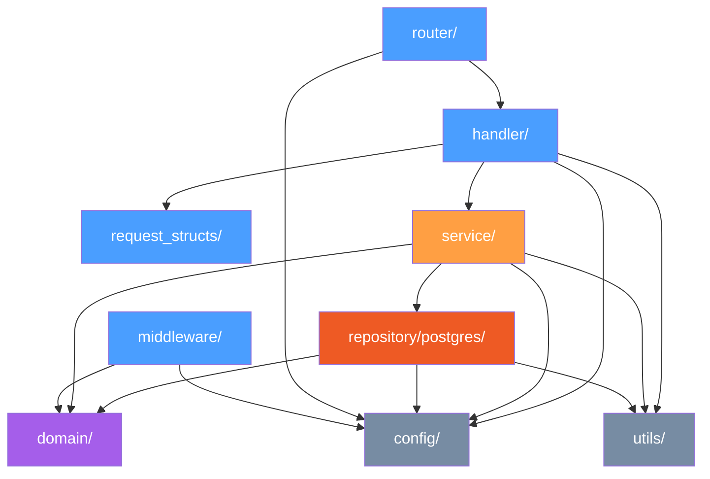

# 🧠 Lógica Interna (internal/)

> **[⬆ API](../)** — `api/internal/`

This directory contains ALL business logic for the ColPsiCarabobo API, following **Clean Architecture** principles. The Go `internal` package keyword ensures no external packages can import this code.

---

## 📁 Directory Structure

| Package | Description |
|---|---|
| `config/` | Environment configuration (singleton pattern) |
| `domain/` | Entity models + repository interfaces (the "contract layer") |
| `handler/` | HTTP request handlers (Fiber context binding, response mapping) |
| `middleware/` | Security perimeter: JWT auth, rate limiting, idempotency, analytics |
| `repository/postgres/` | GORM implementations of domain interfaces |
| `request_structs/` | DTOs with validator tags, multipart support, pointer-based PATCH semantics |
| `router/` | Route definitions and middleware grouping |
| `service/` | Business logic layer (admin, psi, posts, specialties, analytics, mail) |
| `templates/` | Embedded HTML email templates |
| `utils/` | Pure utility functions (validation, sanitization, crypto) |

---

## 🔄 Dependency Flow



### Simplified Flow

```
handler → service → repository → domain (interfaces)
handler → request_structs
service → domain (models)
All → config
All → utils
```

---

## 🏗️ Architecture Rules

### Rule 1: `internal/` Is NOT Importable

Go's `internal/` directory convention prevents any package outside this module from importing anything inside `internal/`. This enforces a strict boundary between public API surface and private implementation.

### Rule 2: Dependencies Flow INWARD

```
handler → service → repository → domain
```

Outer layers depend on inner layers. Inner layers **never** depend on outer layers. This ensures:
- Domain logic is pure and testable
- Services can be swapped without changing handlers
- Repositories can be replaced (e.g., PostgreSQL → MongoDB) without affecting services

### Rule 3: Domain Defines Interfaces, Repository Implements Them

```go
// domain/psychologist.go — Interface definition
type PsychologistRepository interface {
    FindByID(id uuid.UUID) (*Psychologist, error)
    FindAll(filters PsiFilters) ([]Psychologist, int64, error)
    Create(psi *Psychologist) error
    Update(psi *Psychologist) error
    Delete(id uuid.UUID) error
}

// repository/postgres/psychologist_repo.go — Implementation
type PostgresPsychologistRepo struct {
    db *gorm.DB
}

func (r *PostgresPsychologistRepo) FindByID(id uuid.UUID) (*domain.Psychologist, error) {
    // GORM implementation
}
```

### Rule 4: No Circular Dependencies

Package A may not import Package B if Package B imports Package A. The dependency graph is a **DAG** (Directed Acyclic Graph).

---

## 🧩 Module Breakdown

| Module | Domain Entities | Service | Handler | Repository |
|---|---|---|---|---|
| **Admin** | Admin, Role | AdminService | AdminController | PostgresAdminRepo |
| **Psychologist** | Psychologist, Specialty | PsiService | PsiController | PostgresPsychologistRepo |
| **Posts/CMS** | Post, Category | PostService | PostController | PostgresPostRepo |
| **Specialties** | Specialty | SpecialtyService | SpecialtyController | PostgresSpecialtyRepo |
| **Analytics** | Visit, Report | AnalyticsService | AnalyticsController | PostgresAnalyticsRepo |
| **Auth** | Token, Session | AuthService | AuthController | — |

---

## 📊 Statistics

- **Total `.go` files:** ~50+
- **Sub-packages:** 10
- **Modules:** 6 (Admin, Psychologist, Posts, Specialties, Analytics, Auth)
- **Endpoints:** ~30+

---

## 🔒 Security Layers

| Layer | Location | Responsibility |
|---|---|---|
| Rate Limiting | `middleware/` | Throttle auth endpoints |
| JWT Authentication | `middleware/` | Validate Bearer tokens |
| Idempotency | `middleware/` | Prevent duplicate mutations |
| Request Validation | `request_structs/` | DTO validation via `validator` tags |
| Business Rules | `service/` | Authorization logic, data integrity |
| SQL Injection Prevention | `repository/postgres/` | Parameterized queries via GORM |

---

## 🧭 Subdirectorios

| Paquete | Descripción |
|---------|-------------|
| [`config/`](./config/) | Variables de entorno (singleton) |
| [`domain/`](./domain/) | Modelos de dominio + interfaces de repositorio |
| [`handler/`](./handler/) | Handlers HTTP (Fiber) |
| [`middleware/`](./middleware/) | Seguridad: JWT, rate limiter, idempotency, analytics |
| [`repository/postgres/`](./repository/postgres/) | Implementaciones GORM de los repositorios |
| [`request_structs/`](./request_structs/) | DTOs con validación |
| [`router/`](./router/) | Definición de rutas y montaje de middleware |
| [`service/`](./service/) | Lógica de negocio |
| [`templates/`](./templates/) | Plantillas HTML de correos embebidas |
| [`utils/`](./utils/) | Funciones utilitarias puras |

**[⬆ Volver a API](../)**
