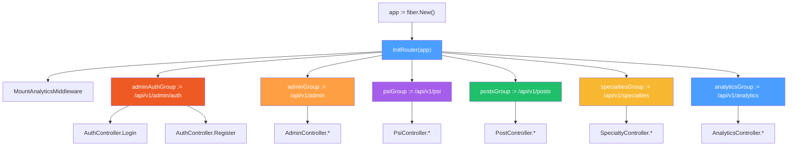

# 🛣️ Router Package (`internal/router/`)

> **[⬆ internal](../)** — `api/internal/router/`

This package defines ALL API routes using **Fiber v2** and mounts middleware per route group.

---

## 📁 Files

| File | Description |
|---|---|
| `router.go` | `InitRouter()` — creates all route groups, mounts sub-routers |
| `psi_router.go` | Psychologist routes (public + authenticated) |
| `post_router.go` | Post/CMS routes (public read, auth write) |
| `admin_router.go` | Admin management routes (auth required) |
| `specialty_router.go` | Specialty catalog routes (public read, admin write) |

---

## 📂 Route Groups

| Base Path | Auth | Description |
|---|---|---|
| `/api/v1/admin/auth/*` | ❌ (rate limited) | Login / Register endpoints |
| `/api/v1/admin/*` | ✅ Required | Admin CRUD operations |
| `/api/v1/psi/*` | ⚡ Optional | Psychologist profiles (public read, auth write) |
| `/api/v1/posts/*` | ⚡ Optional | Posts/CMS (public read, auth write) |
| `/api/v1/specialties/*` | ⚡ Optional | Specialties catalog (public read, admin write) |
| `/api/v1/analytics/*` | ✅ Required | Analytics dashboard |

---

## 📋 Complete Route Table

### Authentication (`/api/v1/admin/auth/`)

| Method | Path | Handler | Middleware |
|---|---|---|---|
| `POST` | `/api/v1/admin/auth/login` | `AuthController.Login` | `Analytics`, `RateLimiter` |
| `POST` | `/api/v1/admin/auth/register` | `AuthController.Register` | `Analytics`, `RateLimiter` |

### Admin Management (`/api/v1/admin/`)

| Method | Path | Handler | Middleware |
|---|---|---|---|
| `GET` | `/api/v1/admin` | `AdminController.ListAdmins` | `Analytics`, `AuthRequired` |
| `POST` | `/api/v1/admin` | `AdminController.CreateAdmin` | `Analytics`, `AuthRequired` |
| `GET` | `/api/v1/admin/:id` | `AdminController.GetAdmin` | `Analytics`, `AuthRequired` |
| `PATCH` | `/api/v1/admin/:id` | `AdminController.UpdateAdmin` | `Analytics`, `AuthRequired` |
| `DELETE` | `/api/v1/admin/:id` | `AdminController.DeleteAdmin` | `Analytics`, `AuthRequired` |

### Admin — Psicólogos (`/api/v1/admin/psi/`)

| Method | Path | Handler | Middleware |
|---|---|---|---|
| `GET` | `/api/v1/admin/psi/birthdays` | `GetBirthdaysByAdmin` | `ProtectedAdmin404` |
| `GET` | `/api/v1/admin/psi/:id/observaciones` | `GetObservacionesByAdmin` | `ProtectedAdmin404` |
| `POST` | `/api/v1/admin/psi/:id/observaciones` | `AddObservacionByAdmin` | `ProtectedAdmin404` |
| `PATCH` | `/api/v1/admin/psi/:id/observaciones/:entryId` | `UpdateObservacionByAdmin` | `ProtectedAdmin404` |

### Psychologist Directory (`/api/v1/psi/`)

| Method | Path | Handler | Middleware |
|---|---|---|---|
| `GET` | `/api/v1/psi` | `PsiController.ListPsychologists` | `Analytics`, `AuthOptional` |
| `GET` | `/api/v1/psi/:id` | `PsiController.GetPsychologist` | `Analytics`, `AuthOptional` |
| `POST` | `/api/v1/psi` | `PsiController.CreatePsychologist` | `Analytics`, `AuthRequired` |
| `PATCH` | `/api/v1/psi/:id` | `PsiController.UpdatePsychologist` | `Analytics`, `AuthRequired` |
| `DELETE` | `/api/v1/psi/:id` | `PsiController.DeletePsychologist` | `Analytics`, `AuthRequired` |

### Posts / CMS (`/api/v1/posts/`)

| Method | Path | Handler | Middleware |
|---|---|---|---|
| `GET` | `/api/v1/posts` | `PostController.ListPosts` | `Analytics`, `AuthOptional` |
| `GET` | `/api/v1/posts/:id` | `PostController.GetPost` | `Analytics`, `AuthOptional` |
| `POST` | `/api/v1/posts` | `PostController.CreatePost` | `Analytics`, `AuthRequired` |
| `PATCH` | `/api/v1/posts/:id` | `PostController.UpdatePost` | `Analytics`, `AuthRequired` |
| `DELETE` | `/api/v1/posts/:id` | `PostController.DeletePost` | `Analytics`, `AuthRequired` |

### Specialties (`/api/v1/specialties/`)

| Method | Path | Handler | Middleware |
|---|---|---|---|
| `GET` | `/api/v1/specialties` | `SpecialtyController.ListSpecialties` | `Analytics`, `AuthOptional` |
| `GET` | `/api/v1/specialties/:id` | `SpecialtyController.GetSpecialty` | `Analytics`, `AuthOptional` |
| `POST` | `/api/v1/specialties` | `SpecialtyController.CreateSpecialty` | `Analytics`, `AuthRequired` |
| `PATCH` | `/api/v1/specialties/:id` | `SpecialtyController.UpdateSpecialty` | `Analytics`, `AuthRequired` |
| `DELETE` | `/api/v1/specialties/:id` | `SpecialtyController.DeleteSpecialty` | `Analytics`, `AuthRequired` |

### Analytics (`/api/v1/analytics/`)

| Method | Path | Handler | Middleware |
|---|---|---|---|
| `GET` | `/api/v1/analytics/dashboard` | `AnalyticsController.Dashboard` | `Analytics`, `AuthRequired` |
| `GET` | `/api/v1/analytics/reports` | `AnalyticsController.Reports` | `Analytics`, `AuthRequired` |

---

## 🔄 Router Initialization Flow

---

## 🔧 Middleware Stack

| Middleware | Applied To | Purpose |
|---|---|---|
| `Analytics` | ALL routes | Track page views, IP, user agent |
| `AuthRequired` | Admin, PSI write, Posts write, Analytics | Reject unauthenticated requests |
| `AuthOptional` | PSI read, Posts read, Specialties | Attach user if token present, continue otherwise |
| `RateLimiter` | Auth endpoints only | Throttle login/register attempts |

---

## 🧩 Key Patterns

1. **AuthOptional on read routes** — Public endpoints still benefit from user context when a token is provided
2. **AuthRequired on write routes** — Mutation endpoints enforce authentication
3. **Analytics on all routes** — Every request is tracked for the analytics dashboard
4. **RateLimiter on auth only** — Prevents brute-force attacks on login/register

---

## 📊 Statistics

- **Total endpoints:** ~22
- **Route groups:** 6
- **Router files:** 5

**[⬆ Volver a internal](../)**
- **Framework:** Fiber v2
