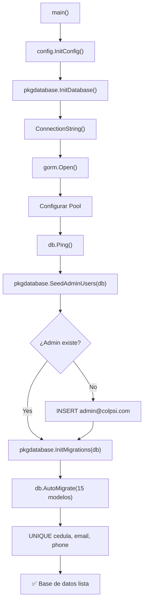

# 📦 pkg/database/

> **[⬆ pkg](../)** — `api/pkg/database/`

## Descripción

Gestiona el **ciclo de vida completo** de la base de datos: conexión, seeding de datos iniciales y migraciones del esquema. Utiliza GORM como ORM y se conecta a PostgreSQL a través de PgBouncer en modo transacción.

---

## 📁 Archivos

| Archivo | Función Principal | Descripción |
|---------|-------------------|-------------|
| `postgres.go` | `InitDatabase() *gorm.DB` | Establece la conexión GORM con PgBouncer |
| `seed.go` | `SeedAdminUsers(db)` | Crea el usuario administrador por defecto |
| `migration.go` | `InitMigrations(db)` | Ejecuta AutoMigrate + constraints UNIQUE |

---

## 🔌 postgres.go — Conexión

`InitDatabase()` realiza los siguientes pasos:

1. **Carga configuración** desde variables de entorno vía `config.InitConfig()`
2. **Construye la URL de conexión** usando `ConnectionString()` (compatible con PgBouncer)
3. **Configura SSL mode** desde `DB_SSL_MODE` (por defecto: `disable`)
4. **Abre la conexión GORM** con el driver `postgres`
5. **Configura el pool de conexiones**:

| Parámetro | Valor | Descripción |
|-----------|-------|-------------|
| `MaxOpenConns` | 10 | Máximo de conexiones abiertas |
| `MaxIdleConns` | 5 | Máximo de conexiones en espera |
| `ConnMaxLifetime` | 1 hora | Tiempo máximo de vida de una conexión |

6. **Verifica la conexión** con `db.Ping()`
7. Retorna la instancia `*gorm.DB`

### Variables de entorno requeridas

```
DB_HOST=localhost
DB_PORT=5432
DB_USER=postgres
DB_PASSWORD=secret
DB_NAME=colpsi_db
DB_SSL_MODE=disable
```

---

## 🌱 seed.go — Seeding

`SeedAdminUsers(db)` crea el usuario administrador por defecto si no existe:

| Campo | Valor |
|-------|-------|
| Email | `admin@colpsi.com` |
| Rol | `ADMINISTRADOR` |
| Nombre | `ColPsi` |
| Apellido | `ColPsi` |

El seed es **idempotente** — verifica la existencia del email antes de insertar.

---

## 🔄 migration.go — Migraciones

`InitMigrations(db)` ejecuta dos fases:

### Fase 1: AutoMigrate

Ejecuta `db.AutoMigrate()` para los 15 modelos del sistema:

```
psi_users
psi_user_col_data
psi_user_audit_models
psi_user_social_networks
psi_user_solvency
psi_user_psi_specialty
psi_user_psi_specialty_relations
psi_user_deontologia
text_models
post_grades
user_admins
user_admin_audit_models
page_views
profile_views
search_events
login_events
active_sessions
```

### Fase 2: Constraints UNIQUE

Aplica restricciones `UNIQUE` vía SQL raw sobre los campos sensibles:

- `cedula` — Cédula de identidad
- `email` — Correo electrónico
- `phone` — Número de teléfono

---

## 🔄 Flujo de Inicialización



---

## 🔒 Seguridad

- Las credenciales de base de datos **solo** se leen de variables de entorno.
- El modo SSL es configurable según el entorno (producción debe usar `require` o `verify-full`).
- PgBouncer en modo transacción limita el consumo de conexiones del servidor PostgreSQL.

---

## 👥 Consumidores

- `cmd/api/main.go` — Punto de entrada que orquesta Init → Seed → Migrate
- `internal/repository/postgres/*` — Repositorios que usan la instancia `*gorm.DB`

**[⬆ Volver a pkg](../)**
